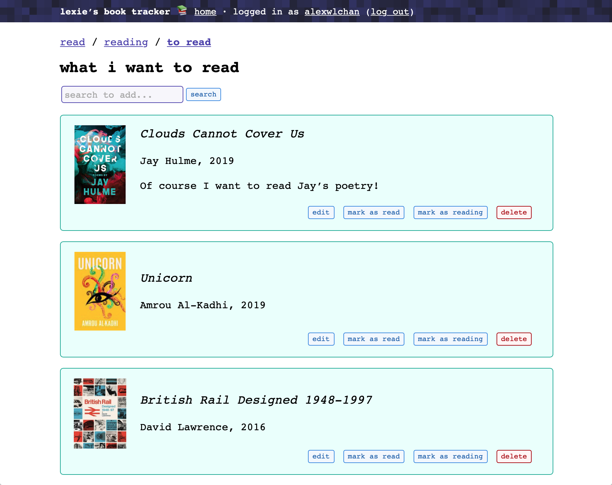

# lexies-book-tracker

This repo has the source code for my book tracker, which is hosted at <https://books.alexwlchan.net/>.
I use it to keep lists of:

*   Books I've read (and any notes/reviews)
*   Books I'm currently reading
*   Books I want to read (and why I want to read them)

It's a Python app that uses Flask as the web server, plus a handful of other useful libraries.
I don't expect anybody else to use this app directly – it's tailored to how I like to organise my books, and unless you're exactly like me you'll probably find my design decisions annoying.
You might find some useful bits in the code, which you're welcome to copy into your own projects.

It was inspired by a <a href="http://tessa-books.glitch.me">similar book tracker</a> created by <a href="https://twitter.com/tessthornton">Tessa Thornton</a>.

*   [How I organise my books](#organise)
*   [Alternatives](#alternatives)
*   [Installation/usage](#installation)
*   [Interesting pieces (aka what to copy)](#interesting)
*   [Licence](#licence)




<h2 id="organise">How I organise my books</h2>

For a long time I used Goodreads to organise my books, but I didn't like shoe-horning my book lists into their organisation system.

If I was designing my ideal book tracker, I'd have three lists:

*   **What I've read.**
    I might write a couple of sentences about the book -- possibly a review, possibly just some notes (so I don't love that Goodreads describes this as "review").

    I find 5-star ratings have two many options, so here there are just three:

    *   I loved it! 😍
    *   I didn’t finish 😔
    *   Neither of the above

*   **What I'm reading right now.**

*   **What I want to read.**
    Within this list, I like to keep notes about the book.
    Why do I want to read it?
    Was it recommended to me, and if so, by who?
    (So I can thank them later.)
    Do I own a copy, or know where I can borrow a copy from?

When I saw Tessa's app, I decided to have a go at taking that idea, and building my own spin on it, but with these lists.

I can search for books, add them to one of these lists, then move a book between lists.
For example, on the "what I want to read" page, there are buttons to mark a book as currently reading or as read.


<h2 id="alternatives">Alternatives</h2>

There are plenty of hosted sites that do this sort of tracking, including Goodreads, Litsy and LibraryThing.

If you want to manage your lists yourself, a good spreadsheet will get you 90% of the functionality of this app.


<h2 id="installation">Installation/usage</h2>

Clone the repo, install the dependencies with pip, set up the database and create a user:

```console
$ git clone git@github.com:alexwlchan/lexies-book-tracker.git
$ cd lexies-book-tracker
$ pip3 install -r requirements.txt
$ flask db upgrade
```

Then in a Python shell:

```pycon
>>> from src import db, models
>>> user = models.User(username=USERNAME)
>>> import getpass
>>> user.set_password(password=PASSWORD)
>>> db.session.add(user)
>>> db.session.commit()
```

To run the app:

```console
$ pip3 install gunicorn
$ GOOGLE_BOOKS_API_KEY="<API_KEY>" gunicorn --bind "127.0.0.1:8000" -w 4 src:app
```

This will start the app running on <http://localhost:8000>.

I am **not supporting** this app.
You are welcome to run it yourself, but the only instance I'm interested in is the one I run for myself.
Do not ask me for troubleshooting advice.


<h2 id="interesting">Interesting pieces (aka what to copy)</h2>

I don't expect anybody will want to use this app directly, but some of the ideas and code might be useful in other projects.
Here's what you might want to use elsewhere:

*   **The autolink and smartypants libraries.**
    I use these libraries to turn user-supplied text into a slightly prettier representation when rendered as HTML.

    For example, when I'm recording a book I want to read, I might link to a tweet or blog post that suggested it.
    These two libraries give me nice typography ([smartypants](https://pypi.org/project/smartypants/)) and turn that link into a `<a>` tag that I can click ([autolink](https://pypi.org/project/autolink/)).

*   **The [isbnlib library](https://pypi.org/project/isbnlib/).**
    So I don't have to worry about the display logic for ISBNs.

*   **Sanitising sensitive credentials with betamax.**
    The [betamax library](https://pypi.org/project/betamax/) lets you record interactions with requests, and replaying them in tests -- I don't have to create mocks, I record real responses!

    When I'm making real requests, I send my Google Books API key, which I don't want to check into a public repo.
    If you look in `tests/conftest.py`, you can see how I'm sanitising the recorded interactions, so they only contain `<API_KEY>`, not my real key.

*   **Adding caching headers to proxied requests in Flask.**
    The app shows thumbnails of book covers, which is a hot-link to an image in Goodreads or Google Books, something like:

    ```html
    
    ```

    Whenever you visit the app, your browser will try to reload *every* image.
    Those images rarely change, so that's a waste of bandwidth.

    To get round this, the app proxies every request for those images, and adds an aggressive `Cache-Control` header -- so the app loads faster, and makes fewer requests to the original site.
    This also gets around the tight CORS headers I set on my web server.

    Look at the `proxy()` route in `src/routes.py` for how this is implemented.


<h2 id="licence">Licence</h2>

MIT.
